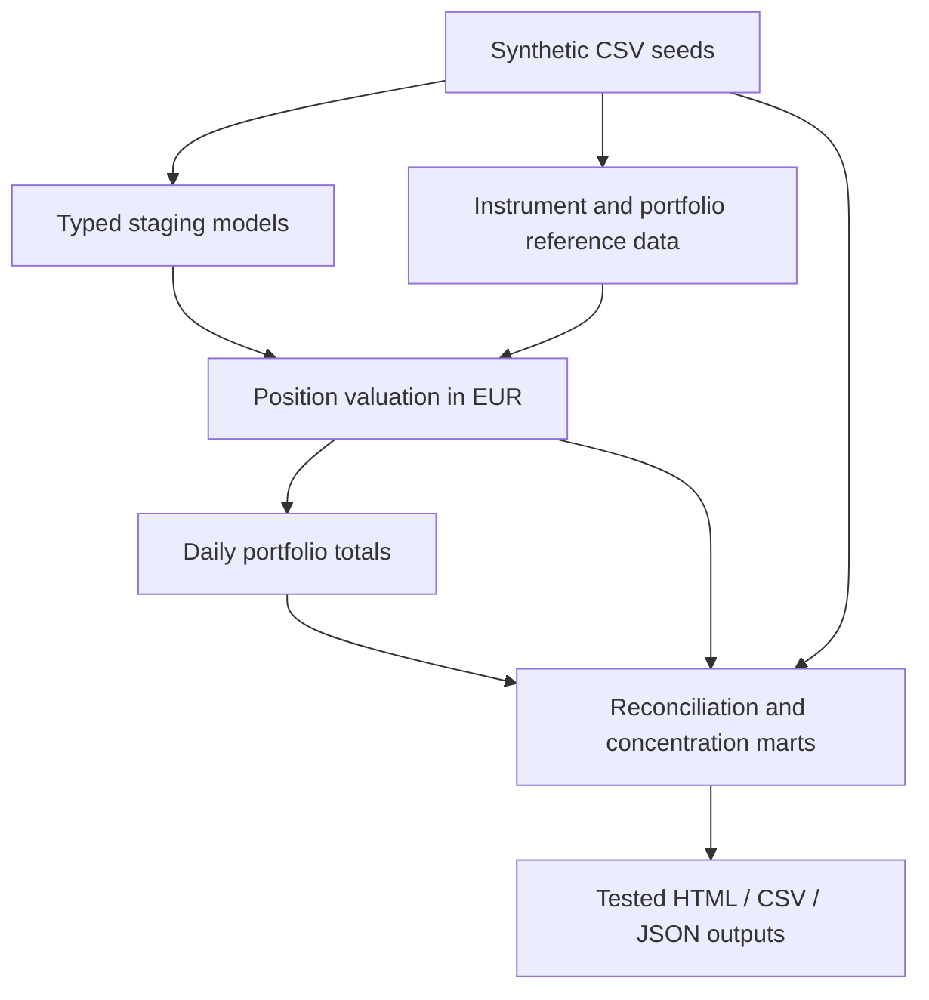

# Financial Data Quality Platform

A reproducible analytics engineering portfolio project by **Haiub Abdelkader Mohamed**.
Synthetic financial data → dbt transformations → reconciliations and risk controls → tested reporting.

**Business problem:** a risk team needs a reliable daily holdings valuation, agreement with an independent
custodian feed, and transparent concentration exceptions. Silent missing prices, duplicated inputs or FX
gaps must not become apparently valid reports.

**Stack:** Python 3.12 · dbt Core / dbt-duckdb · SQL · DuckDB · GitHub Actions.
No paid cloud account, credentials, company data or external APIs are required.

## What this project demonstrates

- Layered data modeling with explicit grains: typed staging, enriched holdings, daily reporting marts.
- EUR valuation from holdings, unit prices and FX; fixed-point decimal arithmetic.
- Full-outer reconciliation with an absolute EUR 1 tolerance and explicit missing-side statuses.
- Instrument concentration checks with illustrative per-portfolio thresholds.
- Structural data tests, business invariants, independent fixture expectations and failure-injection drills.
- Model-level lineage and documentation generated by dbt; operational runbook and PR template.
- CI validation on pull requests; local HTML/CSV reports and a machine-readable alert artifact.

## Architecture



## Quick start

Requires **Python 3.12**. Run commands from the repository root.

Windows PowerShell:
```powershell
py -3.12 -m venv .venv
.\.venv\Scripts\Activate.ps1
python -m pip install -r requirements.txt
python scripts/run_pipeline.py
python scripts/verify_demo.py
python scripts/failure_drill.py
Start-Process outputs/report.html
```

macOS / Linux:
```bash
python3.12 -m venv .venv
source .venv/bin/activate
python -m pip install -r requirements.txt
python scripts/run_pipeline.py
python scripts/verify_demo.py
python scripts/failure_drill.py
```
Open `outputs/report.html` in a browser. It requires no server or JavaScript dependencies.
To inspect model documentation and DAG: `dbt docs serve --profiles-dir .` then open the local URL shown.
Direct build: `dbt build --profiles-dir .`.

## Expected demo results

| Metric | Expected |
|---|---:|
| Input positions | 18 |
| Portfolio-days | 6 |
| Reconciliation exceptions | 1 |
| Exception | P002, 2026-09-29, calculated EUR 38,440.75 vs reference EUR 38,490.75 |
| Difference (internal minus reference) | EUR -50.00 |
| Concentration breaches | 4 |

P003 on 2026-09-29 has a EUR 0.25 reconciliation difference and passes the EUR 1 tolerance.
A known business exception does **not** mean a broken pipeline: valid breaks are published for review.
A structural defect **does** fail the build, and the runner prevents publication of a fresh report.
`alerts.json` is a local artifact, not a real-time paging or email integration.

## Reliability evidence

`scripts/failure_drill.py` builds isolated temporary copies and proves that duplicates, missing FX and
unknown instruments trigger specific failed data tests. It never changes the original input files.
`scripts/verify_demo.py` compares outputs against independently specified golden values.
CI is defined in `.github/workflows/ci.yml`; actual GitHub runs start after the repository is pushed.
CI does not automatically configure branch protection or deploy anything.

## Repository guide

| Path | Purpose |
|---|---|
| `seeds/` | Fictional input data and reference tables |
| `models/staging/` | Types and source-level normalization |
| `models/intermediate/` | Pricing, FX enrichment and valuation |
| `models/marts/` | Portfolio totals, reconciliation and concentration |
| `tests/` | Custom SQL integrity checks and financial invariants |
| `scripts/` | Runner, exports, golden checks and incident drills |
| `docs/` | Architecture, runbook, decisions and interview guide |
| `EMPEZAR_AQUI.md` | Step-by-step Spanish setup and GitHub publishing |
| `examples/` | Portable sample output from the synthetic fixture |

## Scope and limitations

This is an assisted portfolio implementation, not a system deployed at an employer.
All data is synthetic. Holdings are long-only, base currency is EUR and prices are simplified per-unit values.
The system does not compute NAV, accrued interest, fees, liabilities, derivatives exposure or a general ledger.
Concentration is per instrument, not issuer/group, and the 45% demo threshold is not a regulatory limit.
Data is a fixed two-day snapshot; no production SLA or freshness guarantee is claimed.
DuckDB is the implemented warehouse. Snowflake migration is a documented future design, not demonstrated
Snowflake experience. Full rebuilds suit this small fixture; no unsupported cost or scalability claims are made.

## Responsible AI-assisted development

The initial code was generated with AI assistance. The project includes executable checks, explicit
assumptions and failure drills so behaviour can be reviewed rather than accepted on trust.
Before presenting this project, the author should run it, understand each transformation, review test failures
and make their own documented change via a pull request. No proprietary data or credentials were used.

## Documentation

- [Local validation evidence](docs/validation.md)
- [Architecture and data dictionary](docs/architecture.md)
- [Operational runbook](docs/runbook.md)
- [Engineering decisions and Snowflake roadmap](docs/decisions.md)
- [Interview preparation in Spanish](docs/entrevista.md)
- [dbt data tests](https://docs.getdbt.com/docs/build/data-tests)
- [dbt build](https://docs.getdbt.com/reference/commands/build)
- [dbt-duckdb adapter](https://github.com/duckdb/dbt-duckdb)

License: MIT.
